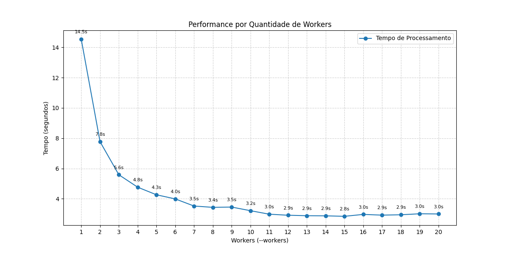

# Classificador Polinomial Mahalanobis em Python

Este projeto é uma implementação em Python do classificador de Distância Polinomial de Mahalanobis. Ele é projetado para analisar imagens `.tif` multiespectrais e gerar um **mapa de distâncias**, que indica a similaridade de cada pixel a um conjunto de amostras de referência.

O sistema é otimizado para processar imagens grandes (ortomosaicos) de forma eficiente, utilizando paralelismo e processamento em tiles.

O repositório é um workspace uv com dois projetos:

- **`packages/polymahalanobis`**: o algoritmo em si (classe `PolyMahalanobis`), publicado no PyPI e instalável isoladamente com `pip install polymahalanobis` (só depende de `numpy`). Veja `packages/polymahalanobis/src/polymahalanobis/README.md` para o uso da biblioteca sozinha.
- **`apps/pipeline`**: o pipeline de CLI descrito abaixo, que consome `polymahalanobis` como dependência. Não é publicado no PyPI.

## O que os programas fazem

- **`packages/polymahalanobis/src/polymahalanobis/PolyModel.py`**: Contém a lógica principal do classificador. A classe `PolyMahalanobis` implementa o modelo que aprende as características de um conjunto de amostras e calcula a distância para novos pixels.

- **`apps/pipeline/src/pipeline/main.py`**: É o programa principal que orquestra o processo. Ele faz o seguinte:
  1.  Carrega as amostras de referência de um arquivo de texto.
  2.  Treina o modelo `PolyMahalanobis`.
  3.  Lê uma imagem de entrada, que deve ser no formato **`.tif`**.
  4.  Processa a imagem em paralelo, dividindo-a em pequenos blocos (tiles).
  5.  Gera uma imagem de saída no formato `.tif`. Esta imagem é um mapa de distância unidimensional (uma única banda de cor) chamada **`polyhealth`**.
  6.  Se a imagem de entrada possuir georreferenciamento, ele será copiado para a imagem de saída.
  7.  Cria _overviews_ (pirâmides) em vários níveis de zoom para acelerar a leitura e visualização em softwares de GIS.

- **`convertConfMahaToNumpybands.py`**: Um script utilitário que converte um arquivo de amostras no formato `.maha` (usado por uma versão anterior em C++) para um formato de texto simples (`.txt`), que é o formato esperado pelo `main.py`.

- **`convertTxtToConfMaha.py`**: O inverso do script anterior. Converte um arquivo de texto com amostras para o formato `.maha`.

## Convenção de Ordem de Bandas

O arquivo de amostras (`samples.txt`) deve estar na **mesma ordem física de bandas** do arquivo `.tif` de entrada (banda 1 → coluna 1, banda 2 → coluna 2, etc.). A pipeline **não reordena automaticamente** as bandas.

**Amostras legadas extraídas com OpenCV (BGR):** se suas amostras têm exatamente 3 colunas e foram extraídas com OpenCV (que decodifica em BGR), use o script `tests/fix_bgr_to_rgb.py` para converter:

```bash
python3 tests/fix_bgr_to_rgb.py amostras_bgr.txt amostras_rgb.txt
```

Isso troca a coluna 1 (Blue) com a coluna 3 (Red), mantendo a coluna 2 (Green) inalterada.

## Reprodutibilidade

Para garantir resultados determinísticos, execute com `PYTHONHASHSEED=42`:

```bash
PYTHONHASHSEED=42 uv run python3 -m pipeline.main ...
PYTHONHASHSEED=42 uv run pytest tests/
```

Isso estabiliza o hash de strings do Python entre execuções. O hash do cache compartilhado usa `blake2b` ou `xxhash` (configurável), que são independentes do `PYTHONHASHSEED`.

## Como usar

### Requisitos

- Python 3
- Dependências gerenciadas via `uv` (fonte de verdade: os `pyproject.toml` de cada projeto do workspace). Instale com:
  ```bash
  uv sync                    # instala packages/polymahalanobis e apps/pipeline (editable)
  uv sync --group=dev        # + dependências de desenvolvimento (pytest, mypy, etc.)
  ```
- (Opcional mas recomendado) GDAL para manipulação de GeoTIFFs e criação de overviews.

### Execução Principal

Para classificar uma imagem, você precisa de:

1.  Uma **imagem de entrada** no formato `.tif` (ex: `imagem.tif`).
2.  Um **arquivo de amostras** (ex: `amostras.txt`). Este arquivo deve conter os valores dos pixels de referência, com um pixel por linha e os valores das bandas separados por espaço.

Execute o pipeline com o seguinte comando:

```bash
uv run python3 -m pipeline.main <imagem_entrada.tif> <imagem_saida.tif> <arquivo_amostras.txt> <arquivo_log.log> [--order ORDEM] [--exp EXP_VALUE] [--tile-size TILE_SIZE] [--workers QTD_WORKERS] [--shared-cache-mb CACHE_MB] [--cache-key-mode EXACT|ROUND] [--cache-key-decimals N] [--hash-strategy BLAKE2B|XXHASH] [--audit-json PATH] [--audit-tile-csv PATH] [--overviews] [--statistics] [--alpha]
```

**Exemplo:**

```bash
uv run python3 -m pipeline.main minha_imagem.tif saida.tif amostras.txt novo.log \
    --order 3 --exp -1.0 --tile-size 1024 --workers 8 \
    --shared-cache-mb 512 --cache-key-mode exact --hash-strategy blake2b \
    --audit-json audit.json --overviews --statistics --alpha
```

- **`imagem_entrada.tif`**: Caminho para a imagem `.tif` a ser processada.
- **`imagem_saida.tif`**: Caminho onde o mapa de distância será salvo.
- **`arquivo_amostras.txt`**: Caminho para o arquivo com os valores das amostras.
- **`arquivo_log.log`**: Nome do arquivo para salvar os logs de execução.
- **`--order`** (opcional): A ordem da expansão polinomial (padrão: 3).
- **`--exp`** (opcional): O valor do expoente usado para gerar o mapa de distância (padrão: -1.0).
- **`--tile-size`** (opcional): O tamanho dos blocos para processamento (padrão: 1024).
- **`--workers`** (opcional): O número de processos paralelos a serem usados (padrão: número de CPUs disponíveis).
- **`--overviews`** (opcional): Gera pirâmides (overviews) no arquivo de saída.
- **`--statistics`** (opcional): Calcula estatísticas do heatmap no final do processamento, gerando faixas de valores (e.g., "pessimo, ruim, medio, bom, excelente") que são salvas no cabeçalho do arquivo de saída.
- **`--alpha`** (opcional): Adiciona um canal alpha (máscara) ao arquivo de saída.
- **`--shared-cache-mb`** (opcional): Tamanho máximo do cache compartilhado entre workers, em MB. `0` desliga o cache (padrão).
- **`--cache-key-mode`** (opcional): `exact` (padrão, preserva resultado) ou `round` (aproximado, pode alterar resultado, requer `--cache-key-decimals`).
- **`--cache-key-decimals`** (opcional): Casas decimais para `--cache-key-mode round`. Mínimo 1. Só válido com `round`.
- **`--hash-strategy`** (opcional): `blake2b` (padrão) ou `xxhash` (requer instalar o extra `apps/pipeline[fast-hash]`, ex: `uv sync --extra fast-hash`).
- **`--audit-json`** (opcional): Caminho para salvar relatório de auditoria em JSON.
- **`--audit-tile-csv`** (opcional): Caminho para salvar métricas por tile em CSV.

## Benchmark

O arquivo `benchmark.py` contém um script para testar a performance do processamento. Ele executa um comando fixo ("hardcoded") para processar um ortomosaico que estava em um caminho específico na máquina de desenvolvimento. O objetivo do teste é medir a velocidade de processamento em relação à quantidade de workers (processos paralelos) utilizados.

O resultado do benchmark está salvo na imagem `time_by_worker_qtd.png`:


